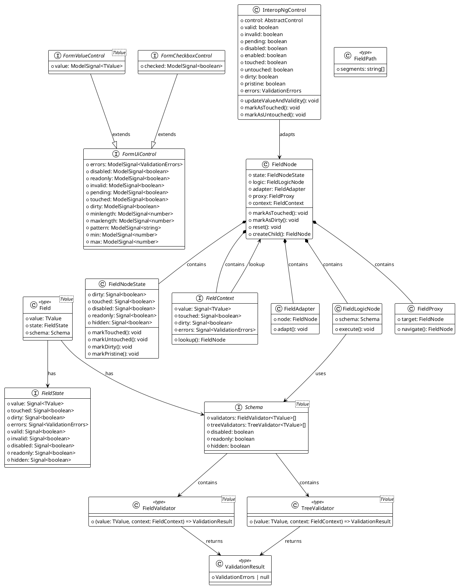

# Диаграмма классов Angular Forms Signals

Анализ архитектуры системы сигнальных форм Angular на основе исходного кода из https://github.com/angular/angular/tree/main/packages/forms/signals

## Диаграмма классов

## Описание архитектуры

### Основные компоненты:

#### 1. Интерфейсы форм
- **FormUiControl** - базовый интерфейс с общими свойствами для всех элементов управления формой
- **FormValueControl<TValue>** - расширяет FormUiControl для стандартных полей ввода с значением
- **FormCheckboxControl** - специализированный интерфейс для чекбоксов с состоянием checked

#### 2. Ядро системы
- **FieldNode** - центральный узел управления полем формы, содержит состояние, логику и адаптеры
- **FieldNodeState** - управляет состоянием поля (dirty, touched, disabled, readonly, hidden)
- **FieldContext** - предоставляет контекст для доступа к состоянию поля и навигации

#### 3. Валидация
- **FieldValidator<TValue>** - функция валидации отдельных полей
- **TreeValidator<TValue>** - функция валидации дерева полей и их дочерних элементов
- **Schema<TValue>** - схема с правилами валидации и логикой поля
- **ValidationResult** - результат валидации (ошибки или null)

#### 4. Интероперабельность
- **InteropNgControl** - мост между новыми сигнальными формами и существующими реактивными формами Angular

#### 5. Вспомогательные классы
- **FieldAdapter** - адаптер для работы с узлами полей
- **FieldLogicNode** - узел для выполнения логики схемы
- **FieldProxy** - прокси для навигации по графу формы
- **FieldPath** - представляет путь к полю в дереве формы

### Ключевые особенности:

1. **Сигнально-ориентированная архитектура** - использует Angular Signals для реактивного управления состоянием
2. **Типобезопасность** - строгая типизация с поддержкой generics
3. **Иерархическая структура** - поддержка вложенных форм и полей
4. **Гибкая валидация** - поддержка валидации на уровне поля и дерева
5. **Обратная совместимость** - интеграция с существующими Angular формами через InteropNgControl
6. **Модульность** - четкое разделение ответственности между компонентами

Архитектура обеспечивает мощную и гибкую систему управления формами с современным подходом на основе сигналов Angular.