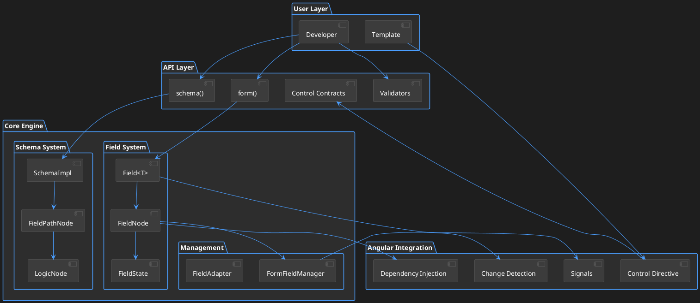
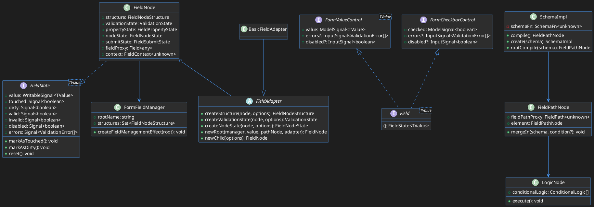
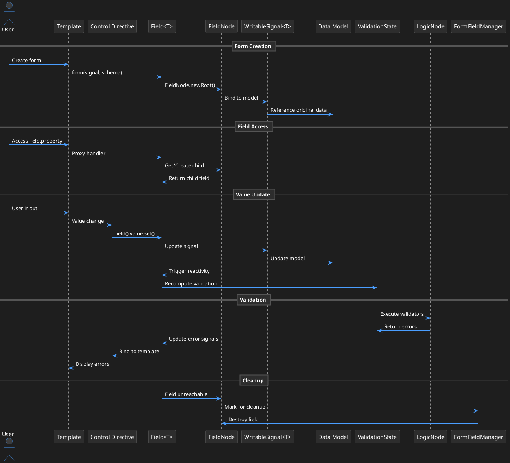
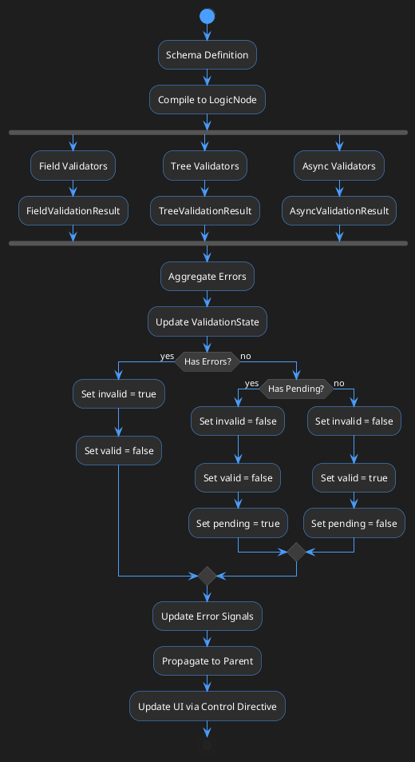

# Документация архитектуры Angular Signal-Based Forms

## Обзор

Angular Signal-Based Forms — это экспериментальный API, который исследует интеграцию сигналов в систему форм. Он предоставляет реактивный, строго типизированный опыт работы с формами, построенный на Angular сигналах, предназначенный для устранения разрыва между template-driven и reactive формами.

## 📁 Структура проекта

```
packages/forms/signals/
├── src/
│   ├── api/                    # Публичные API и типы
│   │   ├── async.ts           # Асинхронные операции
│   │   ├── control.ts         # Контракты форм-контролов
│   │   ├── control_directive.ts # Директива Control
│   │   ├── logic.ts           # Логические функции
│   │   ├── property.ts        # Свойства полей
│   │   ├── structure.ts       # Функции структуры форм
│   │   ├── types.ts           # Основные типы
│   │   ├── validation_errors.ts # Ошибки валидации
│   │   └── validators/        # Встроенные валидаторы
│   ├── field/                 # Внутренняя реализация полей
│   │   ├── node.ts           # Узлы полей
│   │   ├── manager.ts        # Менеджер полей
│   │   ├── state.ts          # Состояние полей
│   │   ├── structure.ts      # Структура полей
│   │   └── ...
│   ├── schema/                # Система схем и логики
│   │   ├── schema.ts         # Реализация схем
│   │   ├── path_node.ts      # Узлы путей
│   │   └── logic_node.ts     # Узлы логики
│   └── util/                  # Утилиты
├── test/                      # Тесты
├── public_api.ts             # Точка входа публичного API
└── PACKAGE.md                # Описание пакета
```

## Основная архитектура

### 1. Система полей (`Field<T>`)

`Field<T>` — это основной строительный блок, представляющий отдельное поле в дереве формы:

- **Структура**: Поля организованы в древовидную структуру, отражающую модель данных
- **Управление состоянием**: Каждое поле поддерживает собственное состояние (значение, валидация, touched, dirty и т.д.)
- **Навигация**: Поля могут переходить к дочерним полям через доступ к свойствам
- **Реактивность**: Все состояние предоставляется как сигналы для реактивных обновлений

**Пример использования:**
```typescript
const nameModel = signal({first: '', last: ''});
const nameForm = form(nameModel);

// Доступ к дочерним полям
const firstNameField = nameForm.first;
const lastNameField = nameForm.last;

// Получение состояния поля
nameForm().value(); // {first: '', last: ''}
nameForm.first().value(); // ''
```

### 2. Система схем

Система схем определяет логику и правила для форм:

- **Определение схем**: Использует `schema<T>(fn)` для определения переиспользуемой логики форм
- **Привязка по путям**: Логика привязывается к конкретным путям в дереве полей
- **Условная логика**: Поддерживает условное применение схем через `applyWhen`
- **Компиляция**: Схемы компилируются в структуры `FieldPathNode`

### 3. Узел поля (`FieldNode`)

Внутренняя реализация полей, которая управляет:

- **Агрегация состояния**: Объединяет несколько менеджеров состояния (валидация, свойства, отправка)
- **Управление структурой**: Обрабатывает родительско-дочерние отношения и создание полей
- **Жизненный цикл**: Управляет созданием и очисткой полей через `FormFieldManager`

## Глубокий анализ основных компонентов

### Структура полей (`src/field/`)

**FieldNode** (`node.ts:44`)
- Центральная реализация интерфейса `FieldState`
- Агрегирует несколько специализированных менеджеров состояния
- Реализует прокси поля для навигации по дереву
- Управляет жизненным циклом поля и очисткой

**FieldNodeStructure** (`structure.ts`)
- Обрабатывает родительско-дочерние отношения
- Управляет привязкой значений полей к модели данных
- Динамически создает дочерние поля на основе структуры данных

**ValidationState** (`validation.ts`)
- Управляет логикой валидации полей и ошибками
- Вычисляет сигналы валидации (valid, invalid, pending)
- Обрабатывает агрегацию ошибок от дочерних полей

**FieldNodeState** (`state.ts`)
- Управляет состоянием UI: touched, dirty, disabled, readonly, hidden
- Отслеживает привязки контролов для интеграции с шаблонами
- Обрабатывает именование и идентификацию полей

### Система схем (`src/schema/`)

**SchemaImpl** (`schema.ts:42`)
- Компилирует функции схем в структуры путей полей
- Управляет контекстом компиляции и кешированием
- Предотвращает бесконечную рекурсию в самоссылающихся схемах

**FieldPathNode** (`path_node.ts`)
- Представляет местоположение в структуре дерева полей
- Управляет привязкой логики и условным применением
- Создает прокси путей полей для навигации

**LogicNode** (`logic_node.ts`)
- Хранит и управляет логическими функциями для конкретного поля
- Обрабатывает выполнение условной логики
- Управляет отслеживанием зависимостей для реактивных обновлений

### Система контролов (`src/api/`)

**Контракты FormControl** (`control.ts`)
- `FormValueControl<T>`: Контракт для контролов на основе значений
- `FormCheckboxControl`: Контракт для контролов чекбоксов
- `FormUiControl`: Базовый контракт для привязки состояния UI

**Директива Control** (`control_directive.ts`)
- Связывает поля с компонентами UI
- Автоматически привязывает состояние поля к свойствам контрола
- Обрабатывает двунаправленный поток данных

## Архитектура потока данных

### 1. Поток создания формы

```
WritableSignal<T> → SchemaImpl.compile() → FieldPathNode → FieldNode.newRoot() → Field<T>
```

1. Пользователь предоставляет `WritableSignal<T>`, содержащий модель данных
2. Схема (если предоставлена) компилируется в дерево `FieldPathNode`
3. Создается корневой `FieldNode` с менеджером полей и адаптером
4. Возвращается прокси поля для взаимодействия с пользователем

### 2. Поток доступа к полям

```
field.property → Proxy Handler → ChildFieldNode → FieldState
```

1. Доступ к свойству поля запускает обработчик прокси
2. Дочернее поле создается/извлекается динамически
3. Возвращается состояние дочернего поля для взаимодействия

### 3. Поток валидации

```
LogicNode → ValidationState → Field.errors → UI Binding
```

1. Узлы логики выполняют функции валидации реактивно
2. Состояние валидации агрегирует ошибки от валидаторов
3. Сигналы ошибок предоставляются компонентам UI
4. Директива контрола привязывает ошибки к элементам управления формы

### 4. Поток обновления значений

```
field().value.set() → WritableSignal → Data Model → Child Field Updates
```

1. Пользователь обновляет значение поля через сигнал
2. Изменение распространяется на базовую модель данных
3. Дочерние поля реактивно обновляются на основе новой структуры
4. Валидация и производное состояние автоматически пересчитываются

## Ключевые паттерны проектирования

### 1. Композиция вместо наследования
- `FieldNode` агрегирует специализированные менеджеры вместо наследования поведения
- Каждый менеджер обрабатывает конкретную область ответственности (валидация, состояние, свойства)

### 2. Навигация на основе прокси
- Навигация по дереву полей использует JavaScript прокси
- Обеспечивает типобезопасный доступ к свойствам: `form.user.name`
- Поддерживает динамическое создание полей на основе структуры данных

### 3. Реактивность на основе сигналов
- Все состояние предоставляется как сигналы Angular
- Автоматическое отслеживание зависимостей и обновления
- Эффективное обнаружение изменений и обновления UI

### 4. Привязка логики на основе путей
- Логика схемы привязывается к путям полей, а не к экземплярам полей
- Обеспечивает переиспользуемые определения схем в разных формах
- Поддерживает применение условной логики

## Жизненный цикл полей

### 1. Создание полей
- Поля создаются лениво при первом доступе
- Родительские поля создают дочерние поля на основе структуры данных
- `FormFieldManager` отслеживает все созданные поля

### 2. Управление полями
- `FormFieldManager.createFieldManagementEffect()` отслеживает достижимость полей
- Недостижимые поля автоматически очищаются
- Предотвращает утечки памяти в динамических формах

### 3. Уничтожение полей
- Поля уничтожаются, когда они больше не достижимы от корня
- Очистка включает эффекты, ресурсы и дочерние поля
- Автоматическая сборка мусора структуры формы

## Интеграция с Angular

### 1. Внедрение зависимостей
- Формы интегрируются с системой DI Angular
- Контекст инжектора сохраняется на протяжении жизненного цикла формы
- Сервисы могут быть внедрены в логику валидации

### 2. Интеграция с шаблонами
- Директива контрола связывает поля с компонентами шаблона
- Автоматическая привязка состояния поля к входам контрола
- Поддержка как пользовательских, так и встроенных элементов управления формы

### 3. Обнаружение изменений
- Реактивность на основе сигналов интегрируется с обнаружением изменений Angular
- Эффективные обновления только при фактическом изменении состояния поля
- Совместим со стратегией обнаружения изменений OnPush

## Основные API

### 1. Создание форм

#### `form(model, schema?, options?)`

Создает форму, обернутую вокруг модели данных:

```typescript
// Простая форма
const model = signal({name: '', age: 0});
const myForm = form(model);

// Форма со схемой
const myForm = form(model, (f) => {
  required(f.name);
  validate(f.age, ({value}) => value() >= 18 ? undefined : 'Минимум 18 лет');
});

// Форма с опциями
const myForm = form(model, schema, {
  injector: customInjector,
  name: 'userForm',
  adapter: customAdapter
});
```

## Текущие ограничения

Как отмечено в `PACKAGE.md:9-14`:
- Отложенная валидация (debouncing)
- Динамические объекты
- Кортежи (tuples)
- Взаимодействие с Reactive/Template формами
- Строго типизированная привязка к элементам управления UI

## Преимущества архитектуры

1. **Типобезопасность**: Полная поддержка TypeScript со строгой типизацией
2. **Производительность**: Реактивность на основе сигналов обеспечивает эффективные обновления
3. **Переиспользуемость**: Подход на основе схем обеспечивает повторное использование логики
4. **Гибкость**: Поддерживает сложные сценарии форм с условной логикой
5. **Интеграция**: Бесшовная интеграция с существующими приложениями Angular
6. **Эффективность памяти**: Автоматическая очистка предотвращает утечки памяти

## Диаграммы PlantUML

### 1. Архитектура системы



### 2. Связи классов



### 3. Диаграмма потока данных



### 4. Поток валидации



Эта архитектура представляет значительную эволюцию в формах Angular, используя сигналы для лучшей производительности и опыта разработчика, сохраняя обратную совместимость и постепенные пути внедрения.