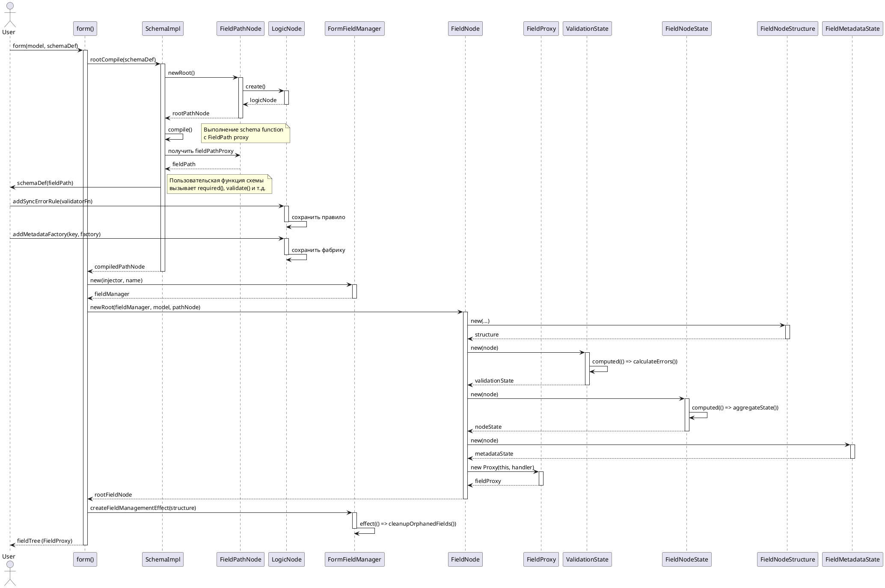
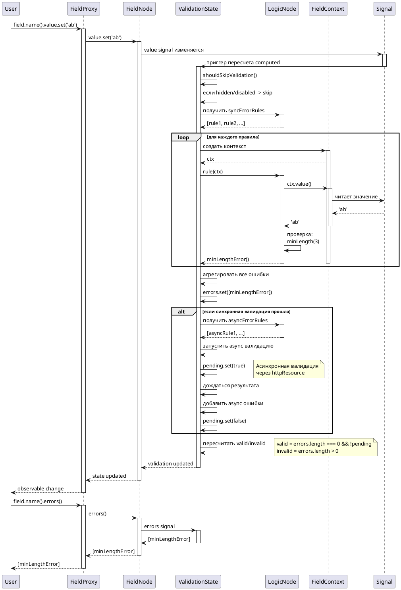
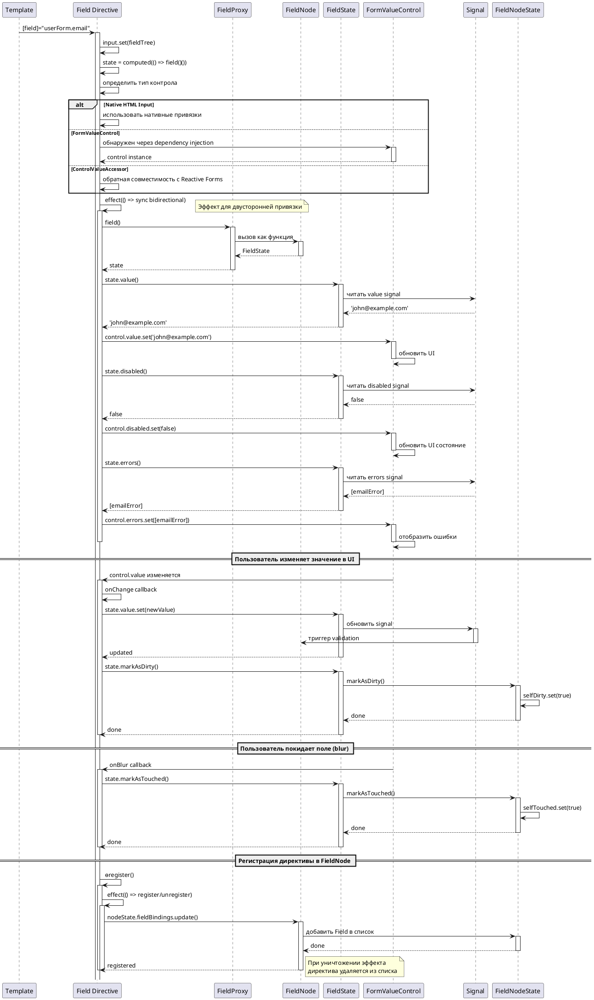
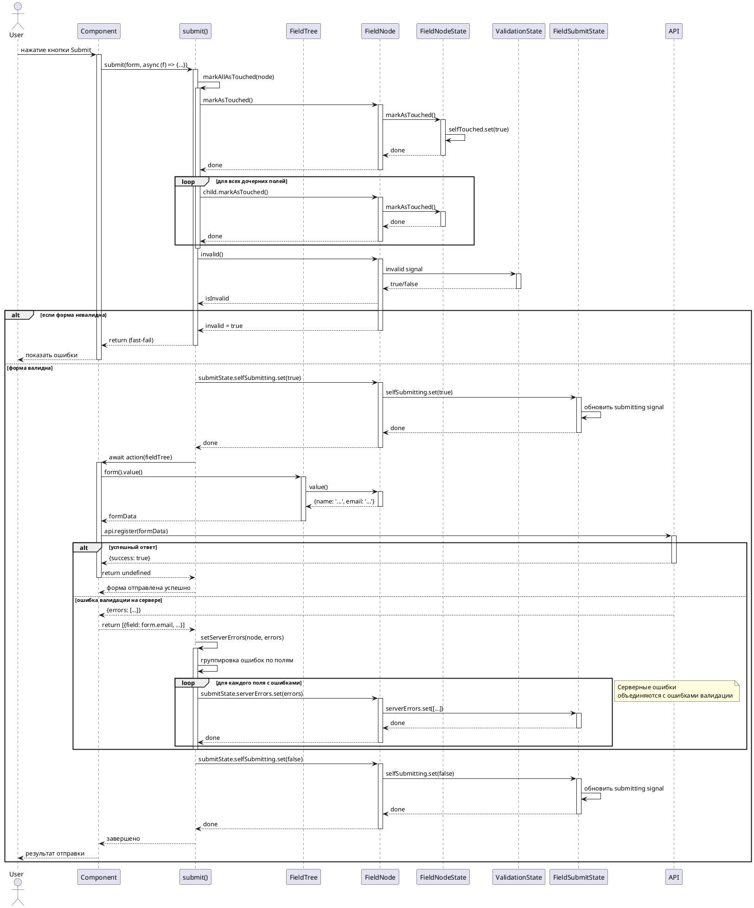
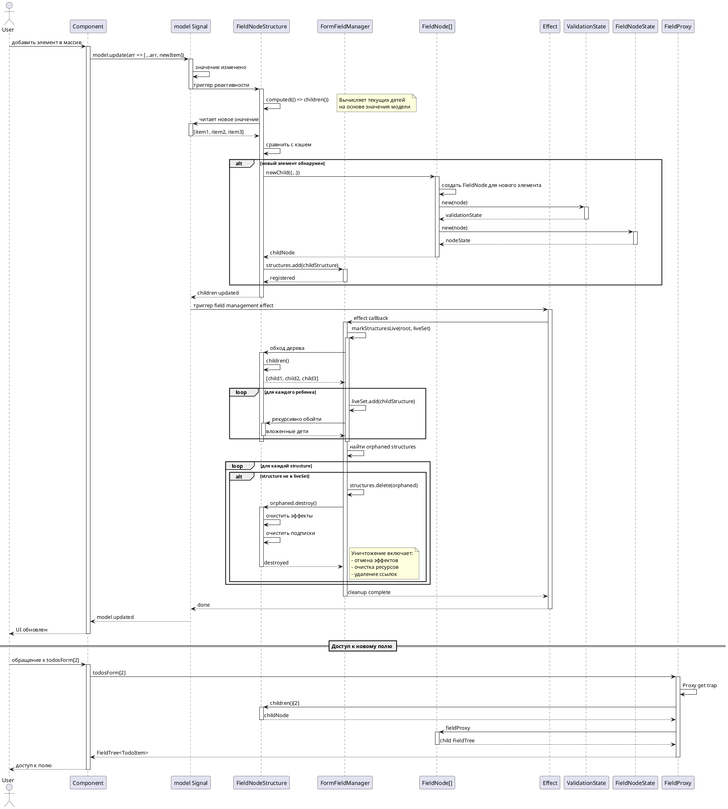

# Angular Signal-Based Forms - Полная документация

> **Статус:** Экспериментальный API
> **Версия:** 21.0.0
> **Каталог:** `packages/forms/signals`

---

## Содержание

1. [Обзор](#обзор)
2. [Документация по использованию API](#документация-по-использованию-api)
   - [Основные концепции](#основные-концепции)
   - [Создание формы](#создание-формы)
   - [Валидация](#валидация)
   - [Условная логика](#условная-логика)
   - [Работа с массивами](#работа-с-массивами)
   - [Привязка к UI контролам](#привязка-к-ui-контролам)
   - [Отправка формы](#отправка-формы)
   - [Метаданные](#метаданные)
   - [Утилиты](#утилиты)
3. [Принцип работы](#принцип-работы)
   - [Архитектура системы](#архитектура-системы)
   - [Основные компоненты](#основные-компоненты)
   - [Жизненный цикл формы](#жизненный-цикл-формы)
4. [Диаграммы](#диаграммы)
   - [Диаграмма классов](#диаграмма-классов)
   - [Диаграммы последовательности](#диаграммы-последовательности)

---

## Обзор

**Angular Signal-Based Forms** - это экспериментальная система форм, построенная на основе сигналов Angular. Она предназначена для изучения возможностей интеграции сигналов в формы и потенциального объединения Template-Driven и Reactive Forms.

### ⚠️ Важно

Этот API находится в стадии активной разработки и не рекомендуется для использования в production-приложениях.

### Цели проекта

- Интеграция сигналов в систему форм Angular
- Объединение преимуществ Template-Driven и Reactive Forms
- Полная обратная совместимость с существующими формами
- Возможность инкрементального внедрения

### Что пока не поддерживается

- Debouncing валидации
- Динамические объекты
- Tuples
- Полная интеграция с Reactive/Template forms
- Строго типизированная привязка к UI контролам

---

# Документация по использованию API

## Основные концепции

### FieldTree

`FieldTree<TValue>` - это главный тип данных, представляющий дерево полей формы. Структура FieldTree повторяет структуру данных модели:

- Для примитивных значений - содержит значение
- Для объектов - содержит поля как свойства
- Для массивов - содержит элементы как индексированные поля

```typescript
// Пример типа FieldTree для объекта
type UserFieldTree = FieldTree<{name: string, age: number}>
// userForm.name - FieldTree<string>
// userForm.age - FieldTree<number>
```

### FieldState

`FieldState<TValue>` - интерфейс, содержащий все состояние поля в виде сигналов:

- `value: Signal<TValue>` - значение поля
- `errors: Signal<ValidationError[]>` - ошибки валидации
- `valid: Signal<boolean>` - валидность
- `invalid: Signal<boolean>` - невалидность
- `pending: Signal<boolean>` - ожидание асинхронной валидации
- `touched: Signal<boolean>` - было ли поле затронуто
- `dirty: Signal<boolean>` - было ли поле изменено
- `disabled: Signal<boolean>` - заблокировано ли поле
- `hidden: Signal<boolean>` - скрыто ли поле
- `submitting: Signal<boolean>` - отправляется ли форма

### FieldPath

`FieldPath<TValue>` - представляет путь к полю в схеме. Используется для привязки логики валидации и поведения к конкретным полям **до** создания формы.

### Schema

`Schema<TValue>` - определяет правила валидации, условия отображения и другую логику для формы.

---

## Создание формы

### Простая форма

```typescript
import {signal} from '@angular/core';
import {form} from '@angular/forms/signals';

// Создание модели данных
const userModel = signal({
  name: '',
  email: '',
  age: 0
});

// Создание формы
const userForm = form(userModel);

// Доступ к состоянию формы
console.log(userForm().value()); // {name: '', email: '', age: 0}
console.log(userForm().valid()); // true/false
```

### Форма с inline-схемой

```typescript
const userForm = form(userModel, (user) => {
  // Валидация имени
  required(user.name);
  minLength(user.name, 3);

  // Валидация email
  required(user.email);
  email(user.email);

  // Валидация возраста
  required(user.age);
  min(user.age, 18, {message: 'Вам должно быть 18+'});
  max(user.age, 120);
});
```

### Форма с переиспользуемой схемой

```typescript
// Создание переиспользуемой схемы
const addressSchema = schema<{street: string, city: string}>((address) => {
  required(address.street);
  required(address.city);
  minLength(address.city, 2);
});

// Использование схемы
const profileForm = form(profileModel, (profile) => {
  required(profile.name);
  apply(profile.address, addressSchema);
});
```

---

## Валидация

### Встроенные валидаторы

#### required - обязательное поле
```typescript
required(path);
required(path, {message: 'Это поле обязательно'});
required(path, {when: (ctx) => ctx.value() !== 'guest'});
```

#### minLength / maxLength - ограничения длины
```typescript
minLength(path, 3);
maxLength(path, 100, {message: 'Максимум 100 символов'});
```

#### min / max - ограничения числовых значений
```typescript
min(path, 0);
max(path, 100);
```

#### pattern - регулярное выражение
```typescript
pattern(path, /^[A-Z][a-z]+$/, {message: 'Начинайте с заглавной буквы'});
```

#### email - проверка email
```typescript
email(path);
email(path, {message: 'Некорректный email'});
```

### Пользовательская валидация

```typescript
validate(user.password, (ctx) => {
  const password = ctx.value();
  if (password.length < 8) {
    return customError({
      kind: 'weakPassword',
      message: 'Пароль должен быть не менее 8 символов'
    });
  }
  return undefined; // нет ошибок
});
```

### Валидация дерева (с доступом к дочерним полям)

```typescript
validateTree(user, (ctx) => {
  const password = ctx.fieldOf(user.password).value();
  const confirmPassword = ctx.fieldOf(user.confirmPassword).value();

  if (password !== confirmPassword) {
    return {
      field: ctx.fieldOf(user.confirmPassword),
      kind: 'passwordMismatch',
      message: 'Пароли не совпадают'
    };
  }
  return undefined;
});
```

### Асинхронная валидация

```typescript
validateHttp(user.username, {
  request: (ctx) => `/api/check-username?username=${ctx.value()}`,
  onSuccess: (response, ctx) => {
    if (response.exists) {
      return customError({message: 'Имя пользователя занято'});
    }
    return undefined;
  },
  onError: (error, ctx) => {
    return customError({message: 'Ошибка проверки имени пользователя'});
  }
});
```

---

## Условная логика

### Скрытие полей

```typescript
hidden(user.companyName, (ctx) => {
  const userType = ctx.valueOf(user.type);
  return userType !== 'business';
});
```

```html
@if (!userForm.companyName().hidden()) {
  <input [field]="userForm.companyName" />
}
```

### Отключение полей

```typescript
// Простое отключение
disabled(user.email);

// Условное отключение
disabled(user.email, (ctx) => {
  return ctx.valueOf(user.emailVerified);
});

// С сообщением
disabled(user.email, 'Email не может быть изменен после верификации');
```

### Поля только для чтения

```typescript
readonly(user.createdAt);
readonly(user.id, (ctx) => ctx.valueOf(user.isPublished));
```

### Условное применение схемы

```typescript
applyWhen(user.businessDetails,
  (ctx) => ctx.valueOf(user.type) === 'business',
  businessDetailsSchema
);
```

---

## Работа с массивами

```typescript
const todosModel = signal([
  {title: 'Task 1', completed: false},
  {title: 'Task 2', completed: true}
]);

const todosForm = form(todosModel, (todos) => {
  // Применить схему к каждому элементу массива
  applyEach(todos, (todo) => {
    required(todo.title);
    minLength(todo.title, 3);
  });
});

// Доступ к элементам
todosForm[0]().value(); // {title: 'Task 1', completed: false}
todosForm.length; // 2
```

---

## Привязка к UI контролам

### Field directive

Директива `[field]` связывает FieldTree с UI контролом:

```typescript
@Component({
  template: `
    <form>
      <!-- Привязка к нативному input -->
      <input [field]="userForm.name" />

      <!-- Привязка к textarea -->
      <textarea [field]="userForm.bio"></textarea>

      <!-- Привязка к checkbox -->
      <input type="checkbox" [field]="userForm.terms" />

      <!-- Отображение ошибок -->
      @for (error of userForm.email().errors(); track error) {
        <span class="error">{{ error.message }}</span>
      }

      <!-- Кнопка submit -->
      <button
        (click)="onSubmit()"
        [disabled]="userForm().invalid() || userForm().submitting()">
        Submit
      </button>
    </form>
  `
})
export class UserFormComponent {
  userForm = form(signal({name: '', email: '', bio: '', terms: false}), (user) => {
    required(user.name);
    email(user.email);
    required(user.terms, {message: 'Вы должны принять условия'});
  });

  async onSubmit() {
    await submit(this.userForm, async (form) => {
      const result = await this.api.createUser(form().value());
      if (result.errors) {
        return result.errors; // Серверные ошибки
      }
      return undefined;
    });
  }
}
```

### FormValueControl (кастомные контролы)

```typescript
@Component({
  selector: 'custom-input',
  template: `<input [(ngModel)]="value" />`
})
export class CustomInput implements FormValueControl<string> {
  value = model<string>('');
  errors = input<readonly ValidationError[]>([]);
  disabled = input<boolean>(false);
  touched = model<boolean>(false);
  // ... другие опциональные свойства
}
```

---

## Отправка формы

```typescript
async function onSubmit() {
  await submit(userForm, async (form) => {
    try {
      const response = await api.register(form().value());

      // Если сервер вернул ошибки валидации
      if (response.validationErrors) {
        return response.validationErrors.map(err => ({
          field: form[err.field], // Указываем, к какому полю относится ошибка
          kind: 'server',
          message: err.message
        }));
      }

      // Успех - нет ошибок
      return undefined;
    } catch (error) {
      // Общая ошибка формы
      return customError({
        kind: 'server',
        message: 'Ошибка сервера'
      });
    }
  });
}
```

**Функция `submit`:**
- Отмечает все поля как `touched`
- Проверяет валидность формы (fast-fail если невалидна)
- Устанавливает `submitting = true`
- Выполняет action
- Применяет серверные ошибки к соответствующим полям
- Сбрасывает `submitting = false`

---

## Метаданные

### Простые метаданные

```typescript
const USER_ID = metadata(user, (ctx) => generateId());

// Получение метаданных
const id = userForm().metadata(USER_ID);
```

### Агрегированные метаданные

```typescript
// Встроенные агрегированные метаданные
userForm().metadata(REQUIRED)(); // boolean
userForm().metadata(MIN)(); // number | undefined
userForm().metadata(MAX)(); // number | undefined
userForm().metadata(MIN_LENGTH)(); // number | undefined
userForm().metadata(MAX_LENGTH)(); // number | undefined
userForm().metadata(PATTERN)(); // RegExp[]

// Создание собственных агрегированных метаданных
const TOTAL_PRICE = reducedMetadataKey<number, number>(
  (acc, price) => acc + price,
  () => 0
);

applyEach(cart.items, (item) => {
  aggregateMetadata(item, TOTAL_PRICE, (ctx) => {
    return ctx.value().price * ctx.value().quantity;
  });
});

// Получение суммы
cart().metadata(TOTAL_PRICE)(); // сумма всех товаров
```

---

## Утилиты

### Сброс формы

```typescript
// Сброс состояния touched и dirty
userForm().reset();

// Сброс данных
userModel.set({name: '', email: '', age: 0});
```

### Доступ к состоянию

```typescript
// Через вызов FieldTree как функции
const state = userForm();
state.value(); // {name: '...', email: '...'}
state.valid(); // true/false
state.errors(); // ValidationError[]
```

### FieldContext в логике

```typescript
validate(user.email, (ctx) => {
  ctx.value(); // Signal<string> - значение текущего поля
  ctx.state; // FieldState<string> - состояние текущего поля
  ctx.field; // FieldTree<string> - текущее поле

  // Доступ к другим полям
  ctx.valueOf(user.name); // string
  ctx.stateOf(user.name); // FieldState<string>
  ctx.fieldOf(user.name); // FieldTree<string>

  return undefined;
});
```

---

# Принцип работы

## Архитектура системы

### Слои системы

Signal-Based Forms состоит из нескольких слоев:

```
┌─────────────────────────────────────┐
│      Public API Layer               │
│  (form, validate, required, etc.)   │
└──────────────┬──────────────────────┘
               │
┌──────────────▼──────────────────────┐
│      Schema Layer                   │
│  (SchemaImpl, FieldPathNode)        │
└──────────────┬──────────────────────┘
               │
┌──────────────▼──────────────────────┐
│      Field Node Layer               │
│  (FieldNode, FieldProxy)            │
└──────────────┬──────────────────────┘
               │
┌──────────────▼──────────────────────┐
│      State Management Layer         │
│  (ValidationState, NodeState, etc.) │
└──────────────┬──────────────────────┘
               │
┌──────────────▼──────────────────────┐
│      Signal Layer (Angular Core)    │
└─────────────────────────────────────┘
```

---

## Основные компоненты

### FieldNode (внутренняя реализация)

`FieldNode` - это внутренний узел дерева формы. Каждое поле представлено экземпляром FieldNode.

**Ответственности:**
- Хранение состояния поля (touched, dirty)
- Вычисление производных сигналов (valid, disabled, errors)
- Навигация по дереву формы (parent, children)
- Интеграция подсистем (validation, metadata, submission)

**Структура:**
```typescript
class FieldNode {
  structure: FieldNodeStructure;      // Структура дерева
  validationState: ValidationState;   // Валидация
  metadataState: FieldMetadataState; // Метаданные
  nodeState: FieldNodeState;         // Состояние узла
  submitState: FieldSubmitState;     // Состояние отправки
  fieldProxy: FieldTree;             // Proxy для навигации
}
```

### FieldProxy (публичный интерфейс)

`FieldProxy` - это Proxy-объект, который предоставляет публичный API для доступа к полям:

```typescript
const userForm = form(model);

// userForm - это FieldProxy
// При вызове как функция возвращает FieldState
userForm(); // FieldState<User>

// При доступе к свойству возвращает вложенный FieldProxy
userForm.name; // FieldTree<string>
userForm.name(); // FieldState<string>

// Для массивов - доступ по индексу
userForm.hobbies[0]; // FieldTree<string>
```

**Реализация через Proxy:**
- `apply` trap - возвращает FieldState при вызове как функции
- `get` trap - возвращает дочерние поля при доступе к свойствам

### Schema System

**SchemaImpl** - компилирует схему валидации в структуру FieldPathNode:

```typescript
// Пользователь пишет
const myForm = form(model, (user) => {
  required(user.name);
  email(user.email);
});

// Внутри происходит:
// 1. SchemaImpl.rootCompile() создает FieldPathNode
// 2. Функция схемы вызывается с FieldPath
// 3. Правила валидации добавляются в LogicNode
// 4. FieldNode создается на основе FieldPathNode
```

**FieldPathNode** - представляет узел в структуре схемы:
- Содержит LogicNode с правилами
- Имеет дочерние FieldPathNode для вложенных полей
- Используется как шаблон для создания FieldNode

**LogicNode** - хранит логику для поля:
- Правила валидации (синхронные и асинхронные)
- Правила disabled/hidden/readonly
- Фабрики метаданных

### Validation System

**ValidationState** управляет валидацией поля:

```typescript
class ValidationState {
  // Вычисляемые сигналы
  errors: Signal<ValidationError[]>;
  valid: Signal<boolean>;
  invalid: Signal<boolean>;
  pending: Signal<boolean>;

  // Методы
  syncValid(): boolean;
  shouldSkipValidation(): boolean;
}
```

**Процесс валидации:**
1. Синхронные валидаторы выполняются реактивно
2. Если синхронная валидация прошла - запускаются асинхронные валидаторы
3. Ошибки агрегируются в signal
4. Поле скрытое/disabled не участвует в валидации родителя

### State Management

**FieldNodeState** управляет пользовательским состоянием:
- `touched` - пользователь взаимодействовал с полем
- `dirty` - значение изменено
- `disabled` - поле заблокировано
- `hidden` - поле скрыто
- `readonly` - поле только для чтения

**Агрегация состояний:**
- Родительское поле `dirty = true`, если хотя бы один потомок `dirty`
- Родительское поле `touched = true`, если хотя бы один потомок `touched`
- Скрытые/disabled поля НЕ учитываются в агрегации

---

## Жизненный цикл формы

### Создание формы

```typescript
const userForm = form(signal({name: '', email: ''}), (user) => {
  required(user.name);
  email(user.email);
});
```

**Шаги:**
1. `SchemaImpl.rootCompile()` компилирует схему
   - Создается корневой FieldPathNode
   - Вызывается функция схемы с FieldPath proxy
   - `required()` и `email()` добавляют правила в LogicNode
2. `FieldNode.newRoot()` создает корневой FieldNode
3. `FormFieldManager.createFieldManagementEffect()` создает эффект для управления полями
4. Возвращается FieldProxy

### Взаимодействие с формой

```typescript
// Чтение значения
userForm.name().value(); // реактивное чтение

// Изменение значения
userForm.name().value.set('John'); // записывает в исходный signal

// Валидация
userForm.name().errors(); // возвращает массив ошибок
userForm().valid(); // true/false
```

**Реактивность:**
- Все состояния - сигналы
- Изменение значения триггерит перевалидацию
- Валидация вычисляется лениво через computed()

### Динамическая структура

Когда структура данных меняется (например, добавление элемента в массив):

```typescript
todosModel.update(todos => [...todos, {title: 'New', done: false}]);
```

**Что происходит:**
1. Signal с моделью изменяется
2. FieldNodeStructure реагирует на изменение
3. FormFieldManager создает новые FieldNode для новых элементов
4. Старые, более не достижимые FieldNode уничтожаются через effect

### Система метаданных

**MetadataKey** - ключ для простых метаданных:
```typescript
const USER_ID = metadata(user, () => generateId());
```

**AggregateMetadataKey** - ключ для агрегированных метаданных:
```typescript
// REQUIRED агрегирует через OR
aggregateMetadata(user.name, REQUIRED, () => true);
user().metadata(REQUIRED)(); // true, если хотя бы один потомок required
```

**Типы агрегации:**
- `orMetadataKey()` - логическое ИЛИ
- `andMetadataKey()` - логическое И
- `minMetadataKey()` - минимум
- `maxMetadataKey()` - максимум
- `listMetadataKey()` - список значений

### Асинхронная валидация

```typescript
validateHttp(user.username, {
  request: (ctx) => `/api/check?username=${ctx.value()}`,
  onSuccess: (response) => response.exists ? usernameError() : undefined,
  onError: (error) => serverError()
});
```

**Процесс:**
1. Создается metadata ключ с httpResource
2. httpResource создается с computed params
3. params = undefined если sync валидация не прошла
4. Async правило добавляется в LogicNode
5. Правило читает статус resource и возвращает 'pending' или errors

### Field Directive

```html
<input [field]="userForm.name" />
```

**Работа директивы:**
1. Принимает FieldTree через input
2. Определяет тип контрола (native, FormValueControl, CVA)
3. Создает двустороннюю привязку значения
4. Привязывает дополнительное состояние (disabled, errors, etc.)
5. Регистрирует себя в FieldNode.fieldBindings

**Типы контролов:**
- Native HTML (input, textarea, select)
- FormValueControl (signal-based custom controls)
- ControlValueAccessor (legacy reactive forms controls)

### Отправка формы

```typescript
await submit(form, async (f) => {
  const result = await api.save(f().value());
  return result.errors;
});
```

**Процесс:**
1. `markAllAsTouched()` - отмечает все поля как touched
2. Fast-fail если форма невалидна
3. Устанавливает `submitting = true`
4. Выполняет action
5. Применяет серверные ошибки через `setServerErrors()`
6. Сбрасывает `submitting = false`

**Серверные ошибки:**
- Группируются по полям
- Записываются в `submitState.serverErrors`
- Очищаются при изменении значения поля

---

# Диаграммы

## Диаграмма классов

```plantuml
@startuml Signal-Based Forms - Class Diagram

!define CORE_COLOR #E3F2FD
!define API_COLOR #FFF3E0
!define SCHEMA_COLOR #F3E5F5
!define FIELD_COLOR #E8F5E9
!define VALIDATION_COLOR #FFE0B2

' ============= CORE TYPES =============
package "Core Types" <<Rectangle>> CORE_COLOR {
  interface "FieldTree<TValue>" as FieldTree {
    + (): FieldState<TValue>
    + [property]: FieldTree<TValue[property]>
    + [index]: FieldTree<TValue[index]>
  }

  interface "FieldState<TValue>" as FieldState {
    + value: Signal<TValue>
    + errors: Signal<ValidationError[]>
    + errorSummary: Signal<ValidationError[]>
    + valid: Signal<boolean>
    + invalid: Signal<boolean>
    + pending: Signal<boolean>
    + dirty: Signal<boolean>
    + touched: Signal<boolean>
    + disabled: Signal<boolean>
    + hidden: Signal<boolean>
    + readonly: Signal<boolean>
    + submitting: Signal<boolean>
    + disabledReasons: Signal<DisabledReason[]>
    + keyInParent: Signal<string|number>
    + fieldBindings: Signal<Field[]>
    + metadata<M>(key): M | Signal<M>
    + hasMetadata(key): boolean
    + reset(): void
  }

  interface "FieldPath<TValue>" as FieldPath {
    + [property]: FieldPath<TValue[property]>
  }

  interface "FieldContext<TValue>" as FieldContext {
    + value: Signal<TValue>
    + state: FieldState<TValue>
    + field: FieldTree<TValue>
    + valueOf<P>(path: FieldPath<P>): P
    + stateOf<P>(path: FieldPath<P>): FieldState<P>
    + fieldOf<P>(path: FieldPath<P>): FieldTree<P>
  }

  interface "Schema<TValue>" as Schema {
    + {abstract} ɵɵTYPE: SchemaFn<TValue>
  }
}

' ============= VALIDATION =============
package "Validation" <<Rectangle>> VALIDATION_COLOR {
  abstract class ValidationError {
    + kind: string
    + field: FieldTree<unknown>
    + message?: string
  }

  class RequiredValidationError extends ValidationError {
    + kind = "required"
  }

  class MinValidationError extends ValidationError {
    + kind = "min"
    + min: number
  }

  class MaxValidationError extends ValidationError {
    + kind = "max"
    + max: number
  }

  class MinLengthValidationError extends ValidationError {
    + kind = "minLength"
    + minLength: number
  }

  class MaxLengthValidationError extends ValidationError {
    + kind = "maxLength"
    + maxLength: number
  }

  class PatternValidationError extends ValidationError {
    + kind = "pattern"
    + pattern: RegExp
  }

  class EmailValidationError extends ValidationError {
    + kind = "email"
  }

  class CustomValidationError extends ValidationError {
    + [key: PropertyKey]: unknown
  }

  class ValidationState {
    - node: FieldNode
    - selfErrors: WritableSignal<ValidationError[]>
    - selfAsyncStatus: Signal<AsyncValidationResult>
    + errors: Signal<ValidationError[]>
    + errorSummary: Signal<ValidationError[]>
    + valid: Signal<boolean>
    + invalid: Signal<boolean>
    + pending: Signal<boolean>
    + syncValid(): boolean
    + shouldSkipValidation(): boolean
  }
}

' ============= FIELD NODE =============
package "Field Node Layer" <<Rectangle>> FIELD_COLOR {
  class FieldNode implements FieldState {
    + structure: FieldNodeStructure
    + validationState: ValidationState
    + metadataState: FieldMetadataState
    + nodeState: FieldNodeState
    + submitState: FieldSubmitState
    + fieldProxy: FieldTree
    + fieldAdapter: FieldAdapter
    - _context?: FieldContext
    + {static} newRoot(): FieldNode
    + {static} newChild(): FieldNode
    + markAsTouched(): void
    + markAsDirty(): void
    + reset(): void
  }

  abstract class FieldNodeStructure {
    + node: FieldNode
    + value: WritableSignal<unknown>
    + logic: LogicNode
    + keyInParent: Signal<string|number>
    + fieldAdapter: FieldAdapter
    + {abstract} children(): FieldNode[]
    + {abstract} destroy(): void
  }

  class RootFieldNodeStructure extends FieldNodeStructure {
    - fieldManager: FormFieldManager
    - pathNode: FieldPathNode
    + children(): FieldNode[]
    + destroy(): void
  }

  class ChildFieldNodeStructure extends FieldNodeStructure {
    - parent: FieldNode
    - pathNode: FieldPathNode
    - identityInParent: unknown
    - initialKeyInParent: string|number
    + children(): FieldNode[]
    + destroy(): void
  }

  class FieldNodeState {
    - node: FieldNode
    - selfTouched: WritableSignal<boolean>
    - selfDirty: WritableSignal<boolean>
    + touched: Signal<boolean>
    + dirty: Signal<boolean>
    + disabled: Signal<boolean>
    + hidden: Signal<boolean>
    + readonly: Signal<boolean>
    + disabledReasons: Signal<DisabledReason[]>
    + fieldBindings: WritableSignal<Field[]>
    + name: Signal<string>
    + markAsTouched(): void
    + markAsUntouched(): void
    + markAsDirty(): void
    + markAsPristine(): void
  }

  class FieldMetadataState {
    - node: FieldNode
    - metadata: Map
    + get<M>(key): M | Signal<M>
    + has(key): boolean
  }

  class FieldSubmitState {
    - node: FieldNode
    + selfSubmitting: WritableSignal<boolean>
    + serverErrors: WritableSignal<ValidationError[]>
    + submitting: Signal<boolean>
  }

  class FieldNodeContext implements FieldContext {
    - node: FieldNode
    + value: Signal
    + state: FieldState
    + field: FieldTree
    + valueOf<P>(path): P
    + stateOf<P>(path): FieldState<P>
    + fieldOf<P>(path): FieldTree<P>
  }

  class FormFieldManager {
    + injector: Injector
    + rootName: string
    + structures: Set<FieldNodeStructure>
    + createFieldManagementEffect(root): void
    - markStructuresLive(structure, liveStructures): void
  }
}

' ============= SCHEMA LAYER =============
package "Schema Layer" <<Rectangle>> SCHEMA_COLOR {
  class SchemaImpl implements Schema {
    - schemaFn: SchemaFn
    + compile(): FieldPathNode
    + {static} create(schema): SchemaImpl
    + {static} rootCompile(schema): FieldPathNode
  }

  class FieldPathNode {
    + logic: LogicNode
    + parent?: FieldPathNode
    + root: FieldPathNode
    + element: FieldPathNode
    + fieldPathProxy: FieldPath
    + {static} newRoot(): FieldPathNode
    + mergeIn(schema): void
    + {static} unwrapFieldPath(path): FieldPathNode
  }

  class LogicNode {
    - disabledReasonRules: Rule[]
    - readonlyRules: Rule[]
    - hiddenRules: Rule[]
    - syncErrorRules: Rule[]
    - syncTreeErrorRules: Rule[]
    - asyncErrorRules: Rule[]
    - metadataFactories: Map
    - aggregateMetadataRules: Map
    + addDisabledReasonRule(rule): void
    + addReadonlyRule(rule): void
    + addHiddenRule(rule): void
    + addSyncErrorRule(rule): void
    + addSyncTreeErrorRule(rule): void
    + addAsyncErrorRule(rule): void
    + addMetadataFactory(key, factory): void
    + addAggregateMetadataRule(key, rule): void
    + merge(other): LogicNode
  }
}

' ============= METADATA =============
package "Metadata" <<Rectangle>> API_COLOR {
  class "MetadataKey<TValue>" as MetadataKey {
    - brand: TValue
  }

  class "AggregateMetadataKey<TAcc, TItem>" as AggregateMetadataKey {
    - brand: [TAcc, TItem]
    + reduce: (acc, item) => TAcc
    + getInitial: () => TAcc
  }

  note right of AggregateMetadataKey
    Predefined keys:
    - REQUIRED: AggregateMetadataKey<boolean, boolean>
    - MIN: AggregateMetadataKey<number|undefined, number|undefined>
    - MAX: AggregateMetadataKey<number|undefined, number|undefined>
    - MIN_LENGTH: AggregateMetadataKey<number|undefined, number|undefined>
    - MAX_LENGTH: AggregateMetadataKey<number|undefined, number|undefined>
    - PATTERN: AggregateMetadataKey<RegExp[], RegExp|undefined>
  end note
}

' ============= FIELD DIRECTIVE =============
package "UI Layer" <<Rectangle>> API_COLOR {
  class Field {
    + field: InputSignal<FieldTree>
    + state: Signal<FieldState>
    - controlValueAccessors?: ControlValueAccessor[]
    - interopNgControl?: InteropNgControl
    + ɵregister(): void
    + ɵgetOrCreateNgControl(): NgControl
    + ɵinteropControlCreate(): void
    + ɵinteropControlUpdate(): void
  }

  interface FormValueControl {
    + value: ModelSignal<TValue>
    + errors?: InputSignal<ValidationError[]>
    + disabled?: InputSignal<boolean>
    + readonly?: InputSignal<boolean>
    + hidden?: InputSignal<boolean>
    + invalid?: InputSignal<boolean>
    + touched?: ModelSignal<boolean>
    + dirty?: InputSignal<boolean>
    + required?: InputSignal<boolean>
    + min?: InputSignal<number>
    + max?: InputSignal<number>
    + minLength?: InputSignal<number>
    + maxLength?: InputSignal<number>
    + pattern?: InputSignal<RegExp[]>
  }

  interface FormCheckboxControl {
    + checked: ModelSignal<boolean>
    + (extends FormUiControl)
  }

  class InteropNgControl extends NgControl {
    + valueAccessor?: ControlValueAccessor
  }
}

' ============= API FUNCTIONS =============
package "Public API Functions" <<Rectangle>> API_COLOR {
  class "<<function>>\nform()" as formFn {
    + form<T>(model: WritableSignal<T>): FieldTree<T>
    + form<T>(model, schema): FieldTree<T>
    + form<T>(model, schema, options): FieldTree<T>
  }

  class "<<function>>\nschema()" as schemaFn {
    + schema<T>(fn: SchemaFn<T>): Schema<T>
  }

  class "<<function>>\napply()" as applyFn {
    + apply<T>(path: FieldPath<T>, schema: Schema<T>): void
  }

  class "<<function>>\napplyEach()" as applyEachFn {
    + applyEach<T>(path: FieldPath<T[]>, schema: Schema<T>): void
  }

  class "<<function>>\napplyWhen()" as applyWhenFn {
    + applyWhen<T>(path, logic, schema): void
    + applyWhenValue<T>(path, predicate, schema): void
  }

  class "<<function>>\nvalidate()" as validateFn {
    + validate<T>(path: FieldPath<T>, logic: FieldValidator<T>): void
  }

  class "<<function>>\nvalidateTree()" as validateTreeFn {
    + validateTree<T>(path: FieldPath<T>, logic: TreeValidator<T>): void
  }

  class "<<function>>\nvalidateAsync()" as validateAsyncFn {
    + validateAsync<T>(path, opts: AsyncValidatorOptions): void
  }

  class "<<function>>\nvalidateHttp()" as validateHttpFn {
    + validateHttp<T>(path, opts: HttpValidatorOptions): void
  }

  class "<<function>>\nsubmit()" as submitFn {
    + submit<T>(form: FieldTree<T>, action): Promise<void>
  }

  class "<<function>>\nValidators" as validators {
    + required(path, config?): void
    + email(path, config?): void
    + min(path, min, config?): void
    + max(path, max, config?): void
    + minLength(path, length, config?): void
    + maxLength(path, length, config?): void
    + pattern(path, pattern, config?): void
  }

  class "<<function>>\nLogic" as logic {
    + disabled(path, logic?): void
    + hidden(path, logic): void
    + readonly(path, logic?): void
  }

  class "<<function>>\nMetadata" as metadataFn {
    + metadata<T>(path, factory): MetadataKey<T>
    + metadata<T>(path, key, factory): MetadataKey<T>
    + aggregateMetadata<T>(path, key, logic): void
  }
}

' ============= RELATIONSHIPS =============

' Core relationships
FieldTree ..> FieldState : returns
FieldState ..> ValidationError : contains
FieldContext ..> FieldTree : provides access
FieldContext ..> FieldState : provides access
FieldContext ..> FieldPath : uses for navigation

' Field Node relationships
FieldNode ..|> FieldState : implements
FieldNode *-- FieldNodeStructure : contains
FieldNode *-- ValidationState : contains
FieldNode *-- FieldMetadataState : contains
FieldNode *-- FieldNodeState : contains
FieldNode *-- FieldSubmitState : contains
FieldNode ..> FieldTree : exposes as
FieldNodeContext ..|> FieldContext : implements
FieldNodeContext --> FieldNode : wraps

ValidationState --> FieldNode : references
ValidationState ..> ValidationError : produces
FieldNodeState --> FieldNode : references
FieldMetadataState --> FieldNode : references
FieldMetadataState ..> MetadataKey : uses
FieldMetadataState ..> AggregateMetadataKey : uses
FieldSubmitState --> FieldNode : references

RootFieldNodeStructure --> FormFieldManager : uses
FieldNodeStructure --> LogicNode : contains
FieldNodeStructure --> FieldNode : references

FormFieldManager --> FieldNodeStructure : manages

' Schema relationships
SchemaImpl ..|> Schema : implements
SchemaImpl --> FieldPathNode : creates
FieldPathNode *-- LogicNode : contains
FieldPathNode ..> FieldPath : exposes as

' UI relationships
Field --> FieldTree : binds
Field ..> FieldState : accesses
Field ..> InteropNgControl : may create
Field ..> FormValueControl : may use
Field ..> FormCheckboxControl : may use

' API relationships
formFn ..> FieldTree : creates
formFn ..> Schema : accepts
formFn --> SchemaImpl : uses
formFn --> FieldNode : creates
formFn --> FormFieldManager : creates

schemaFn ..> Schema : creates
schemaFn --> SchemaImpl : creates

applyFn --> FieldPath : operates on
applyFn --> Schema : applies
applyEachFn --> FieldPath : operates on
applyWhenFn --> FieldPath : operates on

validateFn --> FieldPath : operates on
validateTreeFn --> FieldPath : operates on
validateAsyncFn --> FieldPath : operates on
validateHttpFn --> FieldPath : operates on

validators --> FieldPath : operates on
validators --> LogicNode : adds rules to
logic --> FieldPath : operates on
logic --> LogicNode : adds rules to
metadataFn --> FieldPath : operates on
metadataFn --> MetadataKey : creates/uses

submitFn --> FieldTree : operates on
submitFn ..> ValidationError : may return

@enduml
```



---

## Диаграммы последовательности

### 1. Создание формы



### 2. Валидация поля



### 3. Привязка к UI (Field Directive)



### 4. Отправка формы



### 5. Динамическое изменение структуры (массивы)



---

## Заключение

Эта документация охватывает:

1. **API документацию** - полное руководство по использованию всех функций и концепций
2. **Принцип работы** - глубокое понимание внутренней архитектуры и механизмов
3. **Диаграммы** - визуализация структуры классов и процессов взаимодействия

### Ключевые особенности системы

1. **Signal-Based** - вся реактивность построена на сигналах Angular
2. **Type-Safe** - строгая типизация для всей формы
3. **Declarative Schema** - декларативное определение правил валидации
4. **No Copy Data** - работает напрямую с исходным signal модели
5. **Dynamic Structure** - поддержка динамических массивов и объектов
6. **Interoperability** - совместимость с Reactive Forms через CVA
7. **Async Validation** - встроенная поддержка HTTP валидации
8. **Metadata System** - расширяемая система метаданных

### Полезные ссылки

- **Исходный код:** [packages/forms/signals](packages/forms/signals)
- **Примеры использования:** [packages/forms/signals/test](packages/forms/signals/test)

---

*Документация создана на основе анализа исходного кода Angular Signal-Based Forms (версия 21.0.0)*